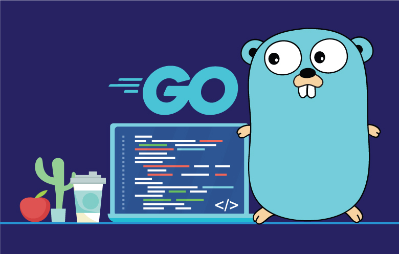

<center><h1>Golang</h1></center>
<center></center>
<h2><b>01-Basics</b></h2>

- <b>Go</b> is a compiled language and has different executables for different Operating Systems.

- It is an object oriented programming language but doesn't contain Classes and Objects , rather has Structs instead classes. The concept of overriding and overloading are also not present.


    ```go
    package main

    import "fmt"

    func main() {
	    fmt.Println("Hello , I am Learning GOLANG !!! ")
    }
    ```

- package main() is the entry point of the program

- Statically defined types : once a variable type is declared , it is fixed and hence type cannot be changed. Almost Everything in the Golang is a type.

    	Types Include:
    	1) String                6) Arrays
    	2) Boolean               7) Slices
    	3) Integer               8) Maps
    	4) Floating              9) Structs
    	5) Complex              10) Pointers

    	-- Functions, Channels are types as well

- LEXER ensures the rules of Grammar are properly followed. Also takes care of semi-colons ;)


<b><h2>10-Slices</h2></b>

- Slices are similar to vectors in C++. They are much more powerful than arrays in Go.

- Append vs Make

Make : Allocates fixed memory
Append : Reallocates new memory, therefore making room for new elements

<b><h2>13-Structs</h2></b>

- Similar to classes in OOP languages
- There is no inheritance in Go, no Super or parent concepts
